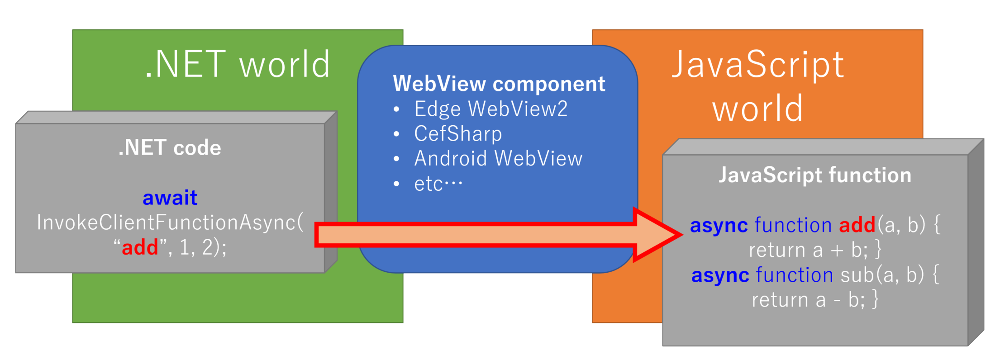
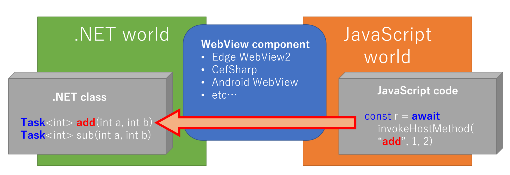

# DupeNukem


DupeNukem - WebView attachable full-duplex asynchronous interoperable independent messaging library between .NET and JavaScript.

[](https://www.repostatus.org/#wip)

## NuGet

|Package|NuGet|
|:--|:--|
|DupeNukem|[](https://www.nuget.org/packages/DupeNukem)|

## CI

|main|develop|
|:--|:--|
|[](https://github.com/kekyo/DupeNukem/actions?query=branch%3Amain)|[](https://github.com/kekyo/DupeNukem/actions?query=branch%3Adevelop)|

----

## What is this?

General purpose `WebView` attachable independent messaging (RPC like) library.

This library is intended for use with a browser component called `WebView` (Edge2, CefSharp, Android, Celenium and etc) where asynchronous interoperation is not possible or is limited.
It is also independent of any specific `WebView` implementation, so it can be applied to any `WebView` you use.
The only requirement is to be able to send and receive strings to and from each other.

This is a diagrammatic representation of the message transfer performed by DupeNukem.

.NET side to call a function on the JavaScript side, the `InvokeClientFunctionAsync` method returns a `Task`, so it can wait asynchronously:



Similarly, JavaScript side to call a method on the .NET side, the `invokeHostMethod` function returns `Promise`, so it can wait asynchronously too:



It is complemental design. Both .NET and JavaScript, we can design methods and functions assuming a nearly identical structure.
And with DupeNukem, you can use it for multi-platform `WebView` based applications without having to use different implementations for each `WebView` interface. The implementation can be standardized.

This may seem simple at first glance, but there are some difficult issues to be addressed, such as the following:

* Each call must be distinguished individually.
  DupeNukem manages each call and correctly distinguishes between them, even if multiple calls exist in parallel. (Yes, it is ready for asynchronous parallelism using `Task.WhenAll` and `Promise.all` and like.)
* On `WebView`, only strings must be used as a means of communication.
  DupeNukem uses JSON as the communication format, but the user does not need to be aware of it, except for custom type conversions.
  This can be thought of as the same as the custom type constraints used for sending and receiving in ASP.NET WebAPI, etc.

## Example

Really? Now let's look at the actual calling code both side.

Invoke JavaScript functions from .NET side:

```csharp
var result_add = await messenger.InvokeClientFunctionAsync<int>(
    "js_add", 1, 2);

var result_sub = await messenger.InvokeClientFunctionAsync<int>(
    "js_sub", 1, 2);
```

Invoke .NET methods from JavaScript side (using proxy objects):

```javascript
// `Add` method
const result_Add = await dupeNukem.viewModels.calculator.add(1, 2);

// `dotnet_add` delegate
const result_add = await dotnet_add(1, 2);
```

Here is an example using:

* [`Microsoft.Web.WebView2`](https://www.nuget.org/packages/Microsoft.Web.WebView2) on WPF. ([Fully sample code is here](https://github.com/kekyo/DupeNukem/blob/main/samples/DupeNukem.WebView2/ViewModels/MainWindowViewModel.cs))
* [`CefSharp.Wpf`](https://www.nuget.org/packages/CefSharp.Wpf) / [`CefSharp.Wpf.NETCore`](https://www.nuget.org/packages/CefSharp.Wpf.NETCore) on WPF. ([Fully sample code is here](https://github.com/kekyo/DupeNukem/blob/main/samples/DupeNukem.CefSharp/ViewModels/MainWindowViewModel.cs))

----

## Setup sequence

Setup sequence is gluing between `WebView` and DupeNukem `Messenger`.
DupeNukem uses only "strings" to exchange messages.
In the code example below (Edge WebView2 on WPF), Step 2 and Step 3 are also set up to mutually exchange message strings.

(Another browser components maybe same as setup process.
See `Gluing another browsers` section below.)

```csharp
// Startup sequence.
// Bound between WebView2 and DupeNukem Messenger.

// Step 1: Construct DupeNukem Messenger.
// Default timeout duration is 30sec.
var messenger = new Messenger();

//////////////////////////////////////////

// Step 2: Hook up .NET --> JavaScript message handler.
messenger.SendRequest += (s, e) =>
    webView2.CoreWebView2.PostWebMessageAsString(e.Message);

// Step 3: Hook up JavaScript --> .NET message handler.
webView2.CoreWebView2.WebMessageReceived += (s, e) =>
    messenger.ReceivedRequest(e.TryGetWebMessageAsString());

// Step 4: Injected Messenger script.
await webView2.CoreWebView2.AddScriptToExecuteOnDocumentCreatedAsync(
    messenger.GetInjectionScript().ToString());
```

----

## Register methods/functions

Bulk register methods on an object:

* Easy way, recommended.

```csharp
// Apply `JavaScriptTarget` attribute on target callee method.
public class Calculator
{
    [JavaScriptTarget]
    public Task<int> Add(int a, int b)
    {
        // ...
    }

    [JavaScriptTarget("Subtract")]   // Strictly naming
    public Task<int> __Sub__123(int a, int b)
    {
        // ...
    }
}

////////////////////////////////////////

// JS: `const result = await dupeNukem.viewModels.calculator.add(1, 2);`
// JS: `const result = await dupeNukem.viewModels.calculator.Subtract(1, 2);`
var calculator = new Calculator();
messenger.RegisterObject(calculator);

// JS: `const result = await calc.add(1, 2);`
// JS: `const result = await calc.Subtract(1, 2);`
messenger.RegisterObject("calc", calculator);

// JS: `const result = await add(1, 2);`         // (Put on `window.add`)
// JS: `const result = await Subtract(1, 2);`    // (Put on `window.Subtract`)
messenger.RegisterObject("", calculator);
```

Register methods around .NET side:

* Strict declarative each methods.

```csharp
// JS: `const result = await dupeNukem.viewModels.mainWindowViewModel.add`
messenger.RegisterFunc<int, int, int>(this.Add);
// JS: `const result = await dupeNukem.viewModels.mainWindowViewModel.Subtract`
messenger.RegisterFunc<int, int, int>(this.__Sub__123);

// Or, register directly delegate with method name.

// JS: `const result = await dotnet_add(1, 2);`
messenger.RegisterFunc<int, int, int>(
    "dotnet_add", (a, b) => Task.FromResult(a + b));
// JS: `const result = await dotnet_sub(1, 2);`
messenger.RegisterFunc<int, int, int>(
    "dotnet_sub", (a, b) => Task.FromResult(a - b));
```

Declare functions around JavaScript side:

```javascript
// Global functions:

// .NET: `var result = await messenger.InvokeClientFunctionAsync("js_add", 1, 2);`
async function js_add(a, b) {
    return a + b;
}

// .NET: `var result = await messenger.InvokeClientFunctionAsync("js_sub", 1, 2);`
async function js_sub(a, b) {
    return a - b;
}

// Member functions:
class Foo
{
    async add(a, b) {
        return a + b;
    }

    async sub(a, b) {
        return a - b;
    }
}

// .NET: `var result = await messenger.InvokeClientFunctionAsync("foo.add", 1, 2);`
// .NET: `var result = await messenger.InvokeClientFunctionAsync("foo.sub", 1, 2);`
var foo = new Foo();
```

NOTE: We have to put JavaScript object instance with `var` keyword.
DupeNukem will fail invoking when use `const` or `let` keyword.
It is limitation for JavaScript specification.

----

## Gluing another browsers

It's knowledges for gluing sample code between your app and browser components.

### CefSharp

```csharp
// Step 2: Hook up .NET --> JavaScript message handler.
messenger.SendRequest += (s, e) =>
    cefSharp.BrowserCore.MainFrame.ExecuteJavaScriptAsync(
        e.ToJavaScript());

// Step 3: Attached JavaScript --> .NET message handler.
cefSharp.JavascriptMessageReceived += (s, e) =>
    messenger.ReceivedRequest(e.Message.ToString());

// Step 4: Injected Messenger script.
var script = messenger.GetInjectionScript();
cefSharp.FrameLoadEnd += (s, e) =>
{
    if (e.Frame.IsMain)
    {
        cefSharp.BrowserCore.MainFrame.ExecuteJavaScriptAsync(
            script.ToString());
    }
};
```

### Xamarin Forms WebView

TODO: Currently unverified

```csharp
// Step 2: Hook up .NET --> JavaScript message handler.
messenger.SendRequest += (s, e) =>
    _ = webView.InjectJavascriptAsync(e.ToJavaScript());

// Step 3: Attached JavaScript --> .NET message handler.
webView.SetJavascriptCallback(messenger.ReceivedRequest);

// Step 4: Injected Messenger script.
var script = messenger.GetInjectionScript();
webView.Navigated += (s, e) =>
{
    if (e.Result == WebNavigationResult.Success &&
        e.Url == webView.Source)
    {
        _ = _webView.InjectJavascriptAsync(script.ToString());
    }
};
```


### Celenium WebDriver on .NET

TODO:

----

## License

Apache-v2.

----

## History

* 0.7.0:
  * Supported CefSharp.
* 0.6.0:
  * Supported proxy object on JavaScript side.
  * Implemented automatic thread marshaling (No need for marshalling to UI threads as manually.)
* 0.5.0:
  * Supported customize json format with `JsonSerializer` and made defaults with camel-casing serialization.
  * Made defaults for all symbol naming to camel case.
  * Added more target platforms.
* 0.4.0:
  * New bulk register methods on an object by `RegisterObject(obj)` method.
  * Fixed invoking silent result with invalid method name.
* 0.3.0:
  * Implemented flexible argument type handling.
* 0.2.0:
  * Improved enum type handling.
* 0.1.0:
  * Initial release.
